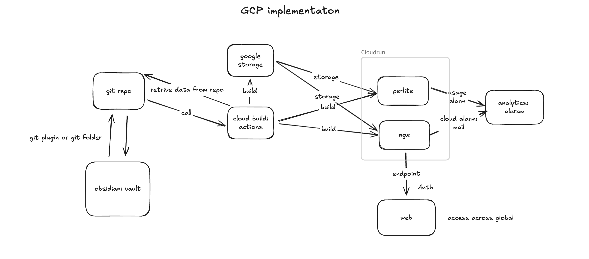

# Perlite Cloud - Self-Hosted Obsidian Web Viewer on GCP



A cloud-native implementation of [Perlite](https://github.com/secure-77/Perlite) for hosting your Obsidian vault as a web application on Google Cloud Platform with zero-scaling capabilities.

## Table of Contents

- [Introduction](#introduction)
- [Why This Project](#why-this-project)
- [What You Need](#what-you-need)
- [Architecture Overview](#architecture-overview)
- [Project Structure](#project-structure)
- [Setup Guide](#setup-guide)
- [Implementation Steps](#implementation-steps)
- [Deployment](#deployment)
- [Authentication & Security](#authentication--security)
- [Cost Analysis](#cost-analysis)
- [Troubleshooting](#troubleshooting)
- [Contributing](#contributing)

## Introduction

Perlite Cloud enables you to host your Obsidian vault as a beautiful web application on Google Cloud Platform. This implementation leverages Cloud Run's serverless architecture to provide a cost-effective, auto-scaling solution that scales to zero when not in use.

### Original Perlite
This project is based on the excellent work of [secure-77/Perlite](https://github.com/secure-77/Perlite), a web-based markdown viewer optimized for Obsidian notes.

## Why This Project

### Problems Solved
- **Cost-Effective Hosting**: Pay only when someone visits your site
- **Zero Maintenance**: Serverless architecture eliminates server management
- **Auto-Sync**: Automatic synchronization between Obsidian and web view
- **Global Access**: Access your notes from anywhere with internet
- **Privacy Control**: Choose between private or public access

### Use Cases
- Personal knowledge base accessible anywhere
- Team documentation with controlled access
- Public documentation sites with zero hosting costs
- Backup web interface for your Obsidian vault

## What You Need

### Prerequisites
- Google Cloud Platform account (free tier available)
- Obsidian vault in a GitHub repository
- Basic familiarity with command line tools
- Docker (for local development)

### Required Tools
- [gcloud CLI](https://cloud.google.com/sdk/docs/install)
- [Git](https://git-scm.com/downloads)
- [Docker](https://docs.docker.com/get-docker/) (optional, for local testing)

## Architecture Overview

The system follows a modern, cloud-native architecture:

```
Obsidian Vault (Local) → GitHub Repository → GitHub Actions → Google Cloud Storage → Cloud Run (Perlite Web App)
```

### Why This Architecture?
1. **Cloud Run Limitations**: Doesn't support persistent volumes
2. **Container Isolation**: Each Cloud Run instance is isolated
3. **Cost Optimization**: Storage + serverless compute = minimal costs
4. **Automation**: GitHub Actions handle synchronization automatically

### Components
- **GitHub Repository**: Stores your Obsidian vault
- **GitHub Actions**: Automates sync to Google Cloud Storage
- **Google Cloud Storage**: Serves as persistent storage for your vault
- **Cloud Run**: Hosts the Perlite web application
- **Container Registry**: Stores the application container image

## Project Structure

```
perlite-cloud/
├── README.md                           # This file
├── Arc-design.png                      # Architecture diagram
├── .gitignore                          # Git ignore rules
├── perlite-web/                        # Main Perlite application
│   ├── Dockerfile                      # Container configuration
│   ├── entrypoint.sh                   # Container startup script
│   ├── index.php                       # Main application file
│   ├── settings.php                    # Application settings
│   └── ...                            # Other Perlite files
├── obsidian-git-gcloud-automate/       # Automation setup
│   ├── .github/workflows/              # GitHub Actions workflows
│   │   └── sync-to-gcs.yml            # Vault sync workflow
│   └── README.md                       # Automation documentation
├── docs/                               # Documentation
│   ├── BucketSync.md                   # Google Cloud Storage setup
│   ├── DeploycloudRun.md               # Cloud Run deployment guide
│   ├── cloudcost.md                    # Cost analysis and optimization
│   └── TestingandAuth.md               # Authentication and testing guide
```

### File Explanations

| File/Directory | Purpose |
|----------------|---------|
| `perlite-web/` | Modified Perlite application with GCS integration |
| `Dockerfile` | Defines the container image with PHP, Nginx, and gcloud SDK |
| `entrypoint.sh` | Downloads vault content from GCS on container startup |
| `sync-to-gcs.yml` | GitHub Actions workflow for automatic sync |
| `settings.php` | Perlite configuration (modify for your needs) |
| Documentation files | Step-by-step guides for setup and deployment |

## Setup Guide

### 1. Clone and Prepare Repository

```bash
# Clone this repository
git clone https://github.com/your-username/perlite-cloud.git
cd perlite-cloud

# Remove example vault (add your own)
rm -rf obsidian-git-gcloud-automate/vault
```

### 2. Prepare Your Obsidian Vault

```bash
# Option 1: Copy your existing vault
cp -r /path/to/your/obsidian/vault obsidian-git-gcloud-automate/vault

# Option 2: Use git submodule (if vault is already in git)
git submodule add https://github.com/your-username/your-vault.git obsidian-git-gcloud-automate/vault
```

### 3. Configure Perlite Settings

Edit `perlite-web/settings.php` to customize your installation:

```php
$siteTitle = "Your Site Title";
$siteDescription = "Your site description";
$siteName = "Your Site Name";
// ... other settings
```

## Implementation Steps

### Step 1: Google Cloud Setup
Follow the detailed guide in [BucketSync.md](docs/BucketSync.md) to:
- Create a Google Cloud project
- Set up Google Cloud Storage bucket
- Configure service accounts and permissions
- Generate authentication keys

### Step 2: GitHub Configuration
1. Add GitHub Secrets (required for GitHub Actions):
   - `GCP_PROJECT_ID`: Your Google Cloud project ID
   - `GCP_SA_KEY`: Service account JSON key content
   - `GCS_BUCKET`: Your bucket name

2. The sync workflow will automatically trigger on pushes to main branch

### Step 3: Container Preparation
The Docker container includes:
- Alpine Linux base
- PHP 8.2 with required extensions
- Nginx web server
- Google Cloud SDK
- Supervisor for process management

No manual container building required - the deployment script handles this.

## Deployment

### Automated Deployment
Follow the comprehensive guide in [DeploycloudRun.md](docs/DeploycloudRun.md):

```bash
# Build and deploy in one command
docker buildx build \
  --platform linux/amd64 \
  -t REGION-docker.pkg.dev/PROJECT_ID/REPO_NAME/perlite-app:latest \
  --push .

gcloud run deploy perlite-service \
  --image REGION-docker.pkg.dev/PROJECT_ID/REPO_NAME/perlite-app:latest \
  --platform managed \
  --region REGION \
  --set-env-vars GCS_BUCKET_PATH=gs://YOUR_BUCKET_NAME
```

### Deployment Configuration
- **Memory**: 512Mi (sufficient for most vaults)
- **CPU**: 1 vCPU
- **Scaling**: 0-10 instances (scales to zero when idle)
- **Timeout**: 300 seconds

## Authentication & Security

The application supports multiple authentication modes. See [TestingandAuth.md](docs/TestingandAuth.md) for detailed configuration:

### Private Access (Recommended)
- Requires Google account authentication
- Use Cloud Run proxy for browser testing
- Perfect for personal or team use

### Public Access
- No authentication required
- Anyone can access your vault
- Only use for non-sensitive content

### Access Control
```bash
# Grant access to specific users
gcloud run services add-iam-policy-binding perlite-service \
  --member="user:friend@example.com" \
  --role="roles/run.invoker"
```

## Cost Analysis

This solution is designed for minimal cost. See [cloudcost.md](docs/cloudcost.md) for detailed analysis:

### Typical Personal Use
- **Storage (5GB vault)**: ~$0.10/month
- **Requests (50K/month)**: $0.00 (free tier)
- **Total**: ~$0.10/month (~$1.20/year)

### Free Tier Limits
- Cloud Run: 2M requests/month
- Cloud Storage: 5GB/month
- Cloud Build: 120 minutes/day

## Obsidian Git Integration

### Automatic Sync with Obsidian Git Plugin
1. Install the [Obsidian Git plugin](https://github.com/Vinzent03/obsidian-git)
2. Configure it to push to your GitHub repository
3. Enable automatic commits and pushes
4. Your web app will update automatically via GitHub Actions

### Manual Sync
```bash
# In your vault directory
git add .
git commit -m "Update notes"
git push origin main
```

## Remove Sensitive Data

Before making your repository public:

1. **Never commit sensitive files**:
   - Service account keys (`.json` files)
   - Personal information in vault
   - Environment variables

2. **Use the provided `.gitignore`** which excludes:
   - Vault contents (keep in separate repository)
   - Service account keys
   - Personal configuration files

3. **Replace placeholder values** in documentation with your actual values

## Authentication Options

### Cloud Run Proxy (Development)
```bash
gcloud run services proxy perlite-service --project=PROJECT_ID
# Access at http://localhost:8080
```

### Direct Access (Production)
- Private: Requires Google account authentication
- Public: Open to internet (use with caution)

## Troubleshooting

### Common Issues

**403 Forbidden Error**
- Use Cloud Run proxy for private services
- Check IAM permissions
- Verify service account configuration

**Sync Not Working**
- Check GitHub Actions logs
- Verify GitHub secrets are set correctly
- Ensure service account has storage permissions

**Container Won't Start**
- Check Cloud Run logs
- Verify environment variables
- Ensure bucket exists and is accessible

### Debug Commands
```bash
# View service logs
gcloud run services logs read perlite-service --region=REGION

# Check service status
gcloud run services describe perlite-service --region=REGION

# Test bucket access
gsutil ls gs://YOUR_BUCKET_NAME
```

## Contributing

We welcome contributions! Please:

1. Fork the repository
2. Create a feature branch
3. Make your changes
4. Test thoroughly
5. Submit a pull request

### Development Setup
```bash
# Clone the repo
git clone https://github.com/your-username/perlite-cloud.git

# Build locally
docker build -t perlite-local .

# Run locally
docker run -p 8080:80 perlite-local
```

## License

This project maintains the same MIT license as the original Perlite project. See the original [Perlite repository](https://github.com/secure-77/Perlite) for license details.

## Acknowledgments

- [secure-77](https://github.com/secure-77) for the original Perlite project
- [Obsidian](https://obsidian.md) for the amazing note-taking application
- [Vinzent03](https://github.com/Vinzent03) for the Obsidian Git plugin

## Support

- 📖 **Documentation**: Check the docs/ directory for detailed guides
- 🐛 **Issues**: Report bugs via GitHub Issues
- 💡 **Feature Requests**: Suggest improvements via GitHub Issues
- 📧 **Contact**: Open an issue for questions

---

**Ready to deploy your Obsidian vault to the cloud?** Start with the [BucketSync.md](docs/BucketSync.md) guide!


